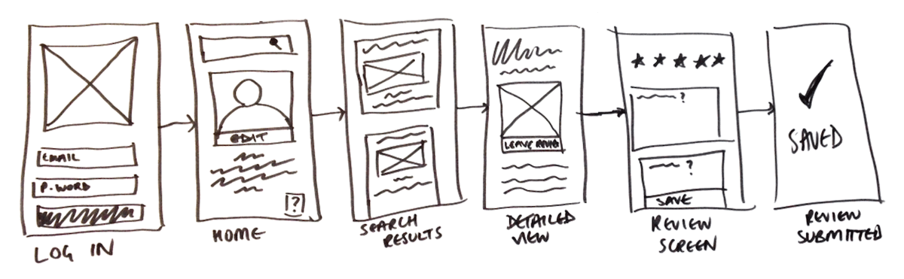

# Valgomat

Beskrivelse av appen. Den er inspirert av [denne andre appen her](https://www.google.com).

## Wireframes

Viser wireframes som illustrerer layout.


## Design
Designvalg du har gjort underveis

## TODO
- Result view needs more love
- Test for differnt screen widths
- Neste gang vil jeg behandle data i tre ulike trinn og i en egen fil

Skrive funksjonen

```js
function calculateScore(inputData, otherData) {
  // do stuff
  return 44
}
```


Refleksjon rundt hva du mener appen mangler, og hva du ville gjort anderledes dersom du skulle gjøre dette igjen

## Known bugs
